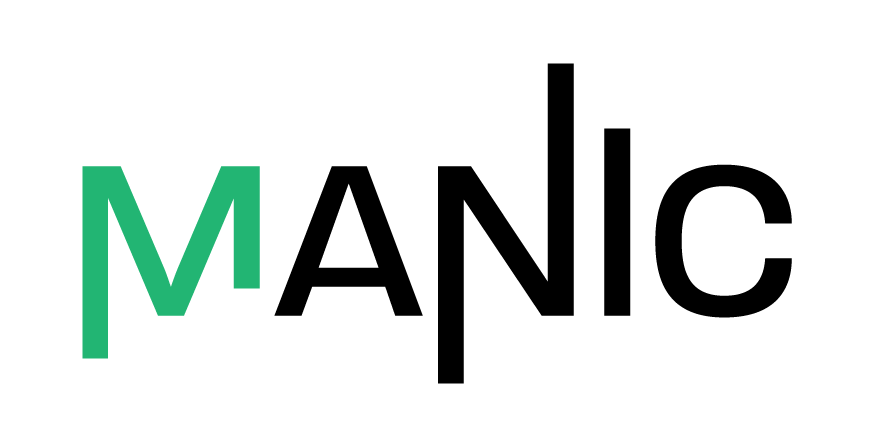

<div align="center">
  
</div>

# MANIC: Mass Analysis & Natural Isotope Correction

**MANIC** is a desktop application for the robust processing and analysis of isotopically labelled mass spectrometry data (GC-MS).

Built with Python and PySide6, it serves as a high-performance successor to the legacy MATLAB GVISO/MANIC suite. It provides a complete workflow for extracting ion chromatograms, correcting for natural isotope abundance, validating peak quality, and calculating absolute metabolite concentrations.

---

## Documentation

### For Users
* **[Getting Started / User Guide](docs/01_user_guide.md)** - *The primary manual. Step-by-step instructions for import, integration, and export.*
* **[Understanding the Output](/docs/Workflow_Data_Interpretation.md)** - *How to interpret the results exported in the excel workbook.*
* **[Updating Old Data](docs/Workflow_Updating_Old_Data.md)** - *How to re-process legacy result files without raw CDF data.*

### Technical Reference
* **[Natural Isotope Correction](docs/Reference_Natural_Isotope_Correction.md)** - *Explanation of the matrix-based correction algorithm.*
* **[Integration Methods](docs/Reference_Integration_Methods.md)** - *Time-based vs. Legacy Unit-spacing integration.*
* **[Abundance Calculation](docs/Reference_Abundance_Calculation.md)** - *Metabolite Response Ratio Factor calculations.*
* **[Peak Validation](docs/Reference_Peak_Validation.md)** - *Criteria for automatic red/green quality indicators.*
* **[Mass Tolerance](docs/Reference_Mass_Tolerance.md)** - *Details on the asymmetric mass binning logic.*

---

## Installation

### Option 1: Standalone Installer (Recommended)
For most users, simply download the latest compiled executable. This requires no Python knowledge or external dependencies.

1.  Navigate to the **[latest release](../../releases/latest)** page of this repository.
2.  Click on the `Assets` drop-down.
3.  Download the installer named `MANIC_Setup.zip`.
4.  Run the installer and follow the on-screen prompts.

### Option 2: Running from Source
If you prefer to run the raw Python code, use the provided execution script.

**Prerequisites:**
* Python 3.10 or higher
* Git
* [uv](https://github.com/astral-sh/uv) (Recommended for dependency management)

**Steps:**

1.  Clone the repository:
    ```bash
    git clone [https://github.com/your-org/clone_pmanic.git](https://github.com/your-org/clone_pmanic.git)
    cd clone_pmanic
    ```

2.  Run the application using the helper script:
    ```bash
    ./scripts/run.sh
    ```
    *(Note: This script automatically handles dependency synchronization and environment setup.)*

---

## Developer Instructions

This project uses modern Python tooling including `uv` for dependency management and `PySide6` for the GUI.

### Development Environment Setup
To set up your local environment for development:

```bash
# Install uv (if not installed)
pip install uv

# Sync dependencies from lockfile
uv sync
```

### Running Tests
The project maintains a test suite covering:
* **Mathematical Correctness:** Verifies mass binning, integration algorithms, and natural abundance correction logic against standard scientific principles and legacy MATLAB behavior.
* **Data Integrity:** Ensures accurate data extraction from CDF files, efficient batch processing, and correct database storage.
* **System Robustness:** Tests edge cases such as missing metadata, zero-width integration windows, and zero-intensity signals.
* **UI Logic:** Validates number formatting, auto-regeneration triggers, and peak quality validation logic.

```bash
# Run all tests using the provided script
./scripts/tests.sh
```

### Building Executables

To compile the application into a standalone Windows executable (.exe) and installer:

1. Ensure you are on a Windows machine.
2. Run the build script:

```DOS 
scripts\build_windows.bat
```

3. Artifacts will be generated in the dist/ and Output/ directories.


```
```

```
```


