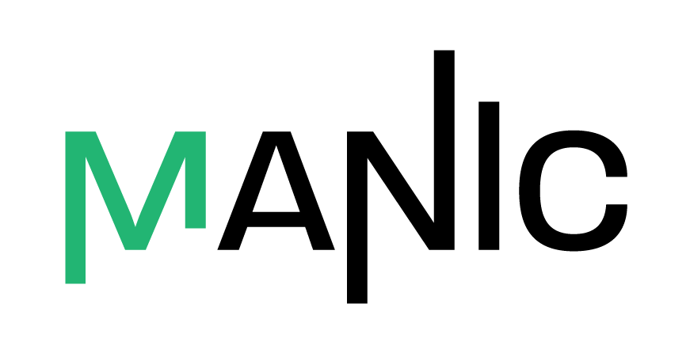

<div align="center">
  
</div>

# MANIC: Mass Analysis & Natural Isotope Correction

**MANIC** is a desktop application for the processing and analysis of isotopically labelled mass spectrometry data (GC-MS).

Built with Python and PySide6, it serves as a successor to the legacy MATLAB [MANIC application](https://doi.org/10.1016/j.ab.2011.04.009). It provides a workflow for extracting ion chromatograms, correcting for natural isotope abundance, validating peak quality, and calculating absolute metabolite concentrations.

If MANIC is useful in your lab, star the
[FrancisCrickInstitute/pMANIC](https://github.com/FrancisCrickInstitute/pMANIC)
repository on GitHub. Stars are a public metric of usefulness and help
justify the resources needed for further development.

## Analysis modes

MANIC asks you to choose a mode when an analysis starts. The choice is fixed for
that session so the same ion signals cannot accidentally be interpreted using
two different scientific models. Switch modes with
**File → New Analysis Session…** (this clears the current session).

- **Labelled** is for stable-isotope tracing. It extracts consecutive M+0 to
  M+n channels and uses natural-abundance correction and label-derived outputs.
- **Unlabelled** is for targeted profiling. It integrates one quantifier ion
  (Q ion) for the reported response and uses qualifier ions, retention
  time, and reference ion ratios as identity-supporting checks. It does
  not apply isotopologue correction or calculate label incorporation.

Full unlabelled documentation (compound-list format, identity QC, UI guides,
export sheets, and scientific rationale) is in
**[Unlabelled Targeted Analysis](docs/Unlabelled_Targeted_Analysis.md)**.

---

## Upgrading to MANIC 5

> **⚠️ The Corrected Values sheet changes in 5.0. Your ratios, label incorporation and calibrated amounts do not, in practice.**

### The short version

- **Raw Values.** Identical to 4.x.
- **Isotope Ratio, % Label Incorporation, % Carbons Labelled.** Change by less than half a percentage point. Your 4.x results stand.
- **Abundances (nmol) for compounds calibrated against MM files.** Change by a fraction of a percent. Your 4.x results stand.
- **Abundances for compounds with no MM-file calibration.** Drop by about a third. 5.0 now labels these columns **Relative** instead of nmol, because they never were absolute amounts.
- **Corrected Values.** Drop by roughly 15 to 40%. Do not compare a 4.x Corrected Values sheet with a 5.0 one. Reprocess the older data in 5.0 first.

### What changed and why

Natural isotope correction works out how much of each isotopologue peak is real
label and how much is the natural ¹³C background. MANIC 4.x, following the
original MATLAB code, did that calculation correctly and then applied one extra
step: it divided every channel by a number slightly below one. That extra step
had no scientific basis. It inflated every corrected value, by more for bigger
and more heavily derivatised molecules. MANIC 5.0 removes it.

Because the inflation was almost the same for every channel of a compound
(within 2%), it cancelled out wherever channels are compared with each other,
which is what every ratio sheet does. It also cancelled out in calibrated
abundances, because the response factor (MRRF) is computed from the same
inflated values and inflates by the same amount. The only place it did not
cancel is a compound whose response factor could not be computed and was
assumed to be 1.0. Those abundances carried the full inflation.

### How we checked

Before releasing 5.0 we took two real lab datasets and processed them from
the raw CDF files twice, once with the 5.0 correction and once with the 4.x
correction swapped in, then compared every number on every sheet.

| Dataset | Compounds | Samples | EICs |
|---|---|---|---|
| CR250807c | 17 | 39 | 663 |
| EH180919 | 97 | 35 | 3395 |

First we confirmed the two versions really differ only by that one extra
division. Across 585 sample and compound pairs, the 4.x number equalled the 5.0
number divided by the extra factor to ten decimal places
(relative deviation 3.6e-10), all the way through deconvolution, baseline
correction and integration. Then we measured how much each exported sheet
moved:

| Sheet | CR250807c (522 pairs) | EH180919 (2662 pairs) |
|---|---|---|
| Corrected Values | median 18.1%, max 26.2% | median 26.4%, max 39.1% |
| Isotope Ratio | median 0.00 pp, max 0.30 pp | median 0.01 pp, max 0.48 pp |
| % Label Incorporation | median 0.06 pp, max 0.29 pp | median 0.04 pp, max 0.47 pp |
| % Carbons Labelled | median 0.02 pp, max 0.16 pp | median 0.02 pp, max 0.47 pp |
| Abundances, MRRF from MM files | median 0.07%, max 2.5% | median 0.13%, max 2.1% |
| Abundances, MRRF assumed 1.0 | none in this dataset | median 31%, max 34% (4 compounds) |

pp means percentage points, so an isotope ratio of 0.400 moving to 0.403 is
0.3 pp. Medians are typical values; maxima are the worst case we found.

The size of the old inflation depends on how big and how derivatised the
molecule is, not on how many positions can carry label. Across 111 labelled
compounds it correlated +0.65 with total atom count and −0.23 with labelled
atoms. Glycine (2 labelled carbons) was inflated 1.44×; Picolinate (6 labelled
carbons) only 1.19×.

Every exported changelog records the MANIC version that produced it, so you
can always tell which correction a workbook used. The mathematics is in
**[Natural Isotope Correction](docs/Reference_Natural_Isotope_Correction.md)**.

---

## Documentation

### For Users
* **[Quick Start](docs/00_quick_start.md)** - *Mode, compound list, CDF folder, review, and export.*
* **[Getting Started / User Guide](docs/01_user_guide.md)** - *The primary manual. Step-by-step instructions for import, integration, and export.*
* **[Unlabelled Targeted Analysis](docs/Unlabelled_Targeted_Analysis.md)** - *Q and qualifier ions, compound lists, identity QC, review UI, and unlabelled exports.*
* **[Understanding the Output](docs/Workflow_Data_Interpretation.md)** - *How to interpret the results exported in the excel workbook.*
* **[Process External Data](docs/Workflow_Process_External_Data.md)** - *How to re-process results files without raw CDF data.*

### Technical Reference
* **[Natural Isotope Correction](docs/Reference_Natural_Isotope_Correction.md)** - *Explanation of the matrix-based correction algorithm.*
* **[Integration Methods](docs/Reference_Integration_Methods.md)** - *Time-based vs. Legacy Unit-spacing integration.*
* **[Baseline Correction](docs/Reference_Baseline_Correction.md)** - *Linear baseline subtraction algorithm.*
* **[Chromatographic Peak Deconvolution](docs/Reference_Chromatographic_Peak_Deconvolution.md)** - *Separating overlapping peaks before integration (per-compound settings, fit models, noise gate).*
* **[Abundance Calculation](docs/Reference_Abundance_Calculation.md)** - *Metabolite Response Ratio Factor calculations.*
* **[Peak Validation](docs/Reference_Peak_Validation.md)** - *Criteria for automatic red/green quality indicators.*
* **[Mass Tolerance](docs/Reference_Mass_Tolerance.md)** - *Details on the asymmetric mass binning logic.*
* **[Label Incorporation and Carbon Enrichment](docs/Reference_Label_Incorporation_Carbon_Enrichment.md)** - *Derivation of the fractional carbon contribution formula.*

---

## Installation

### Option 1: Standalone Installer (Recommended)
For most users, simply download the latest compiled executable. This requires no Python knowledge or external dependencies.

1.  Navigate to the **[latest release](https://github.com/FrancisCrickInstitute/pMANIC/releases/latest)** page of this repository.
2.  Click on the `Assets` drop-down.
3.  Download the installer named `MANIC_Setup.zip` (either the Windows or Mac version).
4. Unzip the downloaded file.
5.  Run the installer and follow the on-screen prompts. When you run this for the first time on a Mac, you might have to go into privacy settings and allow the application to run.

### Option 2: Running from Source
If you prefer to run the raw Python code, use the provided execution script.

**Prerequisites:**
* Python 3.10 or higher
* Git
* [uv](https://github.com/astral-sh/uv) (Recommended for dependency management)

**Steps:**

1.  Clone the repository:
    ```bash
    git clone https://github.com/FrancisCrickInstitute/pMANIC.git
    cd pMANIC
    ```

2.  Run the application using the helper script:
    ```bash
    ./scripts/run.sh
    ```
    *(Note: This script automatically handles dependency synchronization and environment setup.)*

---

## Support & Issues

If something doesn't work as expected or you have an idea to make MANIC better, you can let us know. The easiest way is to use our simple forms on GitHub. No technical knowledge is required.

### Report a Bug or Request a Feature

Please first check if you bug or issue has already been reported by visiting the [Issues](https://github.com/FrancisCrickInstitute/pMANIC/issues) tab on the GitHub repository. If it has not been reported, follow these steps:

1. Click one of the links below:
   * **Report a bug:** [Open the Bug Report form](https://github.com/FrancisCrickInstitute/pMANIC/issues/new?template=bug_report.md)
   * **Request a feature:** [Open the Feature Request form](https://github.com/FrancisCrickInstitute/pMANIC/issues/new?template=feature_request.md)
   * If those links don’t work, go to the **[Issues](https://github.com/FrancisCrickInstitute/pMANIC/issues)** tab and click **New issue**. Then choose either “Bug Report” or “Feature Request.”

2. Sign in to GitHub (or create a free account) if prompted. This helps us track and respond to your request.

3. Fill out the form:
   * For bugs:
     - What happened (and what you expected)
     - Steps to reproduce (what you clicked or did)
     - Any error messages shown
     - Screenshots (optional but helpful)
     - Your operating system (Windows/Mac) and MANIC version
   * For feature requests:
     - What you’d like MANIC to do
     - Why it’s useful (your workflow or problem it solves)
     - Any examples or similar tools you’ve seen

4. Click **Submit**. We’ll review and follow up if we need more details.

---

## Developer Instructions

This project uses modern Python tooling including `uv` for dependency management and `PySide6` for the GUI.

### Development Environment Setup
To set up your local environment for development:

```bash
# Install uv (if not installed)
pip install uv

# Sync dependencies from lockfile
uv sync
```

### Running Tests
The project maintains a test suite covering:
* **Mathematical Correctness:** Verifies mass binning, integration algorithms, and natural abundance correction logic against standard scientific principles and legacy MATLAB behavior.
* **Data Integrity:** Ensures accurate data extraction from CDF files, efficient batch processing, and correct database storage.
* **System Robustness:** Tests edge cases such as missing metadata, zero-width integration windows, and zero-intensity signals.
* **UI Logic:** Validates number formatting, auto-regeneration triggers, and peak quality validation logic.

```bash
# Run all tests using the provided script
./scripts/tests.sh
```

Developers: the performance suite lives in `bench/` and is documented in [bench/README.md](bench/README.md).

### Building Executables

To compile the application into a standalone Windows executable (.exe) and installer:

1. Ensure you are on a Windows machine.
2. Run the build script:

```DOS 
scripts\build_windows.bat
```

3. Artifacts will be generated in the dist/ and Output/ directories.
